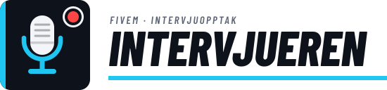

# Intervjueren

Et program i systemstatusfeltet med et overlegg du åpner med hurtigtast. Det tar opp skjermen til **MP4**, eller bare lyd til **MP3 / M4A / WAV**. Laget for å ta opp FiveM-intervjuer som skal transkriberes senere.

## Installere

1. Kjør `Intervjueren-Setup.exe`. Du trenger ikke administratorrettigheter, og ingenting annet må installeres: alt programmet trenger (opptaksmotor og ffmpeg) følger med.
2. Velg mappe, og kryss av for det du vil ha:
   - **Legg til i Start-menyen**
   - **Lag snarvei på skrivebordet**
   - **Start Intervjueren når Windows starter** (venter i systemstatusfeltet). Kan også endres senere under *Innstillinger → Annet*.
3. Vil du ha Intervjueren festet til Start eller oppgavelinjen, høyreklikker du den i Start-menyen og velger *Fest til Start* / *Fest til oppgavelinjen*. (Windows lar ikke installasjonsprogrammer gjøre det.)

Første gang kan Windows SmartScreen si «Windows beskyttet PC-en», fordi installasjonsprogrammet ikke er kodesignert. Trykk *Mer informasjon → Kjør likevel*.

Avinstaller fra *Innstillinger → Apper* i Windows. Opptakene dine slettes ikke.

Programmet ligger i systemstatusfeltet (grå prikk = inaktiv, rød = tar opp, gul = pauset).

### Krav

- Windows 10 (versjon 2004 eller nyere) eller Windows 11, 64-bit.
- For lett videoopptak: et grafikkort/en prosessor med maskinvarekoder (NVIDIA, AMD eller Intel) og oppdatert grafikkdriver. Uten det brukes prosessoren (x264), som er tyngre.

## Standard hurtigtaster (kan endres i Innstillinger)

| Handling                 | Taster |
|--------------------------|--------|
| Vis / skjul overlegg     | Alt+O  |
| Start / stopp opptak     | Alt+R  |
| Pause / fortsett         | Alt+P  |
| Sett tidsmarkør          | Alt+M  |

Markører lagres ved siden av opptaket som `<navn>.markører.txt` (f.eks. `00:12:34  Markør 3`), slik at du lett finner viktige øyeblikk når du transkriberer.

## Oppsett i FiveM

For at overlegget og REC-indikatoren skal vises over spillet, sett FiveM til **Settings → Graphics → Screen Type: Windowed Borderless**. Ekte fullskjerm skjuler alle overlegg, men hurtigtastene virker fortsatt.

Overlegget og REC-indikatoren kommer ikke med i selve opptaket.

## Hva som tas opp

- **Spill og talechat:** all lyd som spilles av på PC-en (Windows loopback), så stemmene til andre spillere kommer med.
- **Mikrofonen din:** mikses inn, med egen volumkontroll.
- Nivåmålerne i overlegget viser begge kildene live, så du kan sjekke mikrofonen før du starter.

## Lett og rask

Selve opptaket gjøres ikke av Electron, men av en liten opptaksmotor (`bin\intervjueren-engine.exe`, skrevet i Rust) sammen med ffmpeg:

- **Video:** skjermen fanges og kodes på grafikkortet (Desktop Duplication → maskinvarekoder). Under **Innstillinger → Video → Videokoder** velger du:
  - **Automatisk** (standard): beste koder som finnes på PC-en.
  - **NVIDIA (NVENC)**, **AMD (AMF)** eller **Intel (Quick Sync)**: grafikkortets egen koder, nesten ingen belastning på prosessoren. Kodere PC-en ikke har, er grået ut.
  - **Prosessor (x264)**: virker på alle PC-er, men bruker mye mer prosessorkraft. Bare for PC-er uten maskinvarekoder.

  Virker ikke den valgte koderen, bytter opptaket automatisk til den beste som virker, og du får en melding.
- **Lyd:** systemlyd (WASAPI loopback) og mikrofon mikses i motoren, med støydemping (RNNoise).
- **Overlegget** lages bare når du åpner det, og fjernes et minutt etter at du lukker det. Electron kjører uten maskinvareakselerasjon og med færrest mulig prosesser.

Målt på en Ryzen 7 7700X / RTX 3090:

| | Prosesser | Minne (privat) | CPU |
|---|---|---|---|
| I systemstatusfeltet | 3 | ca. 41 MB | 0 % |
| Under opptak (1080p30 + mik + systemlyd) | 9 | ca. 560 MB (ca. 390 av dem er NVIDIA-driveren i ffmpeg) | ca. 5 % av én kjerne |

## Krasjsikkerhet

Opptaket skrives fortløpende til `<lagringsmappe>\.raw\` som MKV-deler. Pause, eller om ffmpeg skulle stoppe, starter bare en ny del. Hvis programmet eller PC-en krasjer midt i et intervju, gjør neste oppstart automatisk om delene til `..._gjenopprettet.mp4` / `.mp3`. Lukkes Electron uventet, lagrer motoren opptaket selv.

Standard lagringsmappe: `Videoer\FiveM-intervjuer`. Du endrer den med **Endre…** i overlegget.

## Logo

Logoen ligger i `assets/` (`logo.svg`, `logo-wordmark.svg` for mørk bakgrunn, `logo-wordmark-light.svg` for lys bakgrunn). Etter endringer i `assets/logo.svg`, kjør `npm run icons` for å lage nye ikoner til programmet, systemstatusfeltet og installasjonsprogrammet.

## Bygge

Fra en fersk klone (krever Node.js 22+):

```
npm install
npm run dist
```

`npm run dist` laster selv ned ffmpeg til `bin\` første gang (`npm run ffmpeg`), siden filen er for stor for git. Opptaksmotoren ligger ferdig bygget i `bin\`, så Rust trengs bare hvis du endrer `engine\`.

Detaljer:

- `npm run engine` bygger opptaksmotoren på nytt (krever Rust) og kopierer den til `bin\`. Trengs bare etter endringer i `engine\`.
- `npm run dist` lager installasjonsprogrammet `release\Intervjueren-Setup.exe` (sidene med avkrysningsbokser ligger i `build\installer.nsh`). `npm run pack` lager bare den utpakkede appen i `release\win-unpacked\`.
- `Start Intervjueren.bat` starter appen rett fra kildekoden.
- `bin\ffmpeg.exe` er gyan.dev **ffmpeg 8.0.1 essentials** (GPL, lisens i `bin\ffmpeg-LICENSE.txt`). Ikke bytt til ffmpeg 9.0: der feiler `scale_d3d11`, som NVENC-opptaket trenger.
- Opptaksmotoren bygges med statisk C-runtime (`engine\.cargo\config.toml`), så brukerne ikke trenger Visual C++ Redistributable.
- Forrige versjon (der Chromium tok opp alt) ligger i `backup\v1-chromium-recorder\`.
- `Tauri-Version\` er et eksperiment med samme opptaksmotor i en Tauri-app. For å bygge den: kopier `bin\ffmpeg.exe` til `Tauri-Version\src-tauri\resources\`, og kjør `npm install` og `npm run build` i `Tauri-Version\`.
